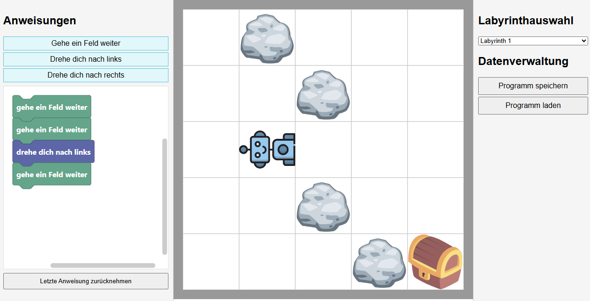

# 🤖 Robby-Blockly

Ein interaktives Tool zum Probieren und Verstehen einfacher Anweisungen für einen Roboter – inspiriert von Turtle Graphics. 

## 🔍 Funktionen

- Interaktives Probieren der Blöcke und ihrer Wirkung
- Auswahl verschiedener Hindernisstouren mit steigender Schwierigkeit und Blockzahl
- Speichern/Laden des Programmcodes als JSON

## 🖼️ Screenshot



## 🚀 Online ausprobieren

> Wird unterstützt durch **GitHub Pages**.

👉 [Hier klicken, um das Projekt direkt im Browser zu starten](https://tonitaste.github.io/Robby/index.html)

## 📦 Installation (lokal)

Du kannst das Projekt lokal starten, indem du die Dateien einfach in einen Ordner speicherst und `index.html` in einem Browser öffnest:

```bash
git clone https://github.com/ToniTaste/Robby.git
cd Robby
# Dann: index.html im Browser öffnen
