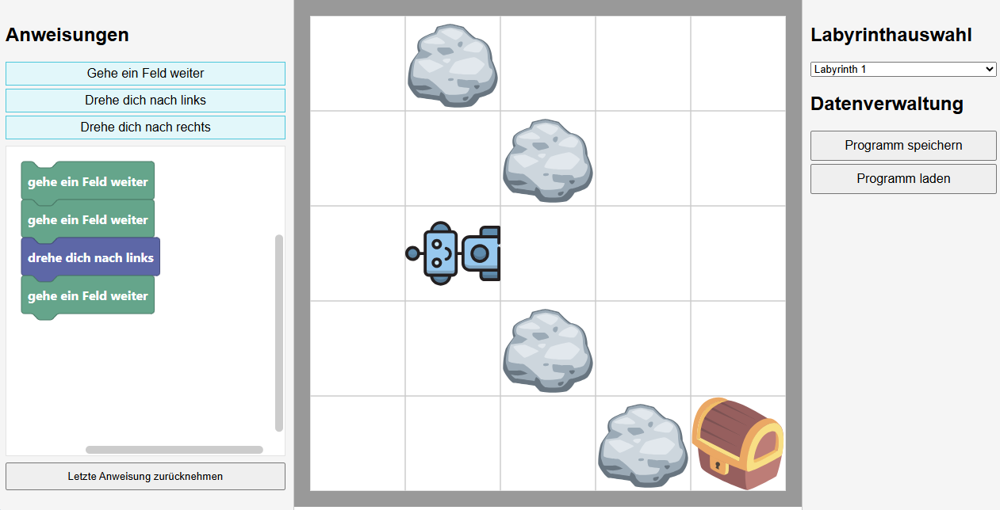

# 🤖 Robby-Blockly

Ein interaktives Tool zum Probieren und Verstehen einfacher Anweisungen für einen Roboter – inspiriert von Turtle Graphics. 

## 🔍 Funktionen

- Interaktives Probieren der Blöcke und ihrer Wirkung
- Auswahl verschiedener Hindernisstouren mit steigender Schwierigkeit und Blockzahl
- Weitere Labyrinth ladbar - Entwickle eigene Labyrinthe mit dem [Robby-Editor](https://github.com/ToniTaste/Robby-Edit))
- Speichern/Laden des Programmcodes als JSON

## 🖼️ Screenshot



## 🚀 Online ausprobieren

> Wird unterstützt durch **GitHub Pages**.

👉 [Hier klicken, um das Projekt direkt im Browser zu starten](https://tonitaste.github.io/Robby/index.html)

## 📦 Installation (lokal)

Du kannst das Projekt lokal und ohne Internetzugang betreiben. Lade dazu alles über Code - Download ZIP herunter, entpacke das Archiv in einen Ordner und öffne `index.html` in einem Browser. Alternativ kannst du auch so vorgehen:

```bash
git clone https://github.com/ToniTaste/Robby.git
cd Robby
# Dann: index.html im Browser öffnen
```

## Grafikquellen
Vectors and icons by <a href="https://www.svgrepo.com" target="_blank">SVG Repo</a>
- robot.svg - COLLECTION: Universe 17, LICENSE: CC0 License, UPLOADER: SVG Repo
- rock.svg - COLLECTION: Twemoji Emojis, LICENSE: MIT License, AUTHOR: Twitter
- hole.svg - COLLECTION: Fxemoji Emojis, LICENSE: Apache License, AUTHOR: Mozilla
- treasure.svg - COLLECTION: Lechazo Conf Flat Vectors, LICENSE: CC Attribution License, AUTHOR: lechazoconf
- tree.svg - COLLECTION: Tree Variations Flat Icons, LICENSE: CC0 License, UPLOADER: SVG Repo
- waves.svg - COLLECTION: Symbol, LICENSE: CC0 License, UPLOADER: SVG Repo
